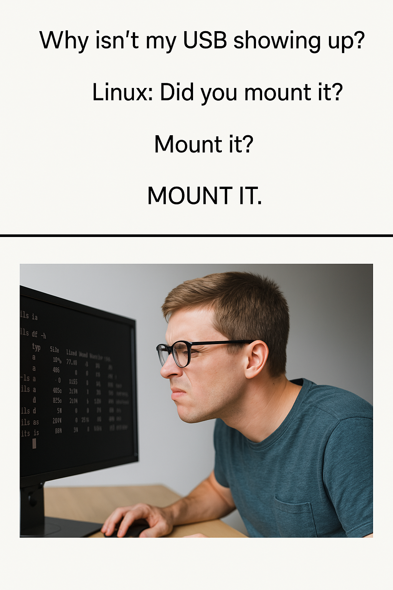

Greetings, fellow command-line explorer! 🧑‍🚀 Whether you're just starting your Linux journey or you've already sudo-ed your way into some chaos, there's one thing you'll definitely need to understand: mounting.

Don’t worry — mounting isn’t complicated or scary. It’s just Linux’s thoughtful way of connecting your storage devices so you can actually use them.

## 🧠 So, What Exactly Is Mounting?
    
In Linux, mounting is the process of making a storage device or filesystem accessible at a certain location in the system's directory tree. Think of it like plugging in a USB drive. when it's mounted, you can open it and see the files; when it's unmounted, it's invisible to the system.

💡 Linux treats everything as a file, and that includes disks and partitions. There’s no special drive letter system (like C:\ or D:\ in Windows). Instead, Linux uses a single directory tree starting from / (root), and everything gets mounted somewhere within it.

## 🛠️ Mounting Staff the Cool Way

Here’s how you ask Linux nicely to mount something:

```shell
sudo mount /dev/sdb1 /mnt/usb
```
Let's decode that:
  * /dev/sdb1 — This is the device (your USB, probably full of critical data).

  * /mnt/usb — This is where you want to access it from.

Before running that, you should make sure the mount point folder exists:

```shell
sudo mkdir /mnt/usb
```
Boom. You're mounted. 💥

📌 We say "please" with sudo, and Linux says “Okay, here you go.”


## 📤 Don’t Just Yank It — Unmount Like a Responsible Nerd

Before pulling the plug, you gotta unmount the device. Why? Because Linux is polite and likes to say goodbye properly. 💔

```shell
sudo umount /mnt/usb
```

This is basically Linux etiquette — like putting the dishes away after using them. 🍽️

If you just pull out the USB without unmounting, Linux might panic a little, and you could lose data and no one wants corrupted data.


## ⚙️ Want It Done Automatically? Enter /etc/fstab

If you want Linux to remember your mounting habits like a clingy ex, use the /etc/fstab file 😉

Here’s how you can tell Linux to mount something automatically at boot:

```shell
/dev/sdb1    /mnt/usb    ext4    defaults    0    0
```

## 🔍 Want to See What’s Mounted?

Check current mounts like this:

```shell
df -h
```

Or the slightly messier (but classic) way:

```shell
mount
```

Either way, Linux gives you the whole story, like a verbose but helpful librarian.

## 🧹 Quick Recap
### Command  _  What It Does
    mount       >	Connects a device to the system
    umount	    >   Safely disconnects it
    /etc/fstab  >	Sets up auto-mounting
    df -h       >   Shows current mounts and disk space

## 🎤 Final Thoughts

Mounting might seem tricky at first, but once you get the hang of it, it’s super powerful. You’ll find yourself using it all the time — especially when managing servers, external drives, or virtual machines.

Keep experimenting, and don’t be afraid to get your hands dirty in the terminal! 🖥️



Happy mounting, and may your filesystems always be clean. ✨